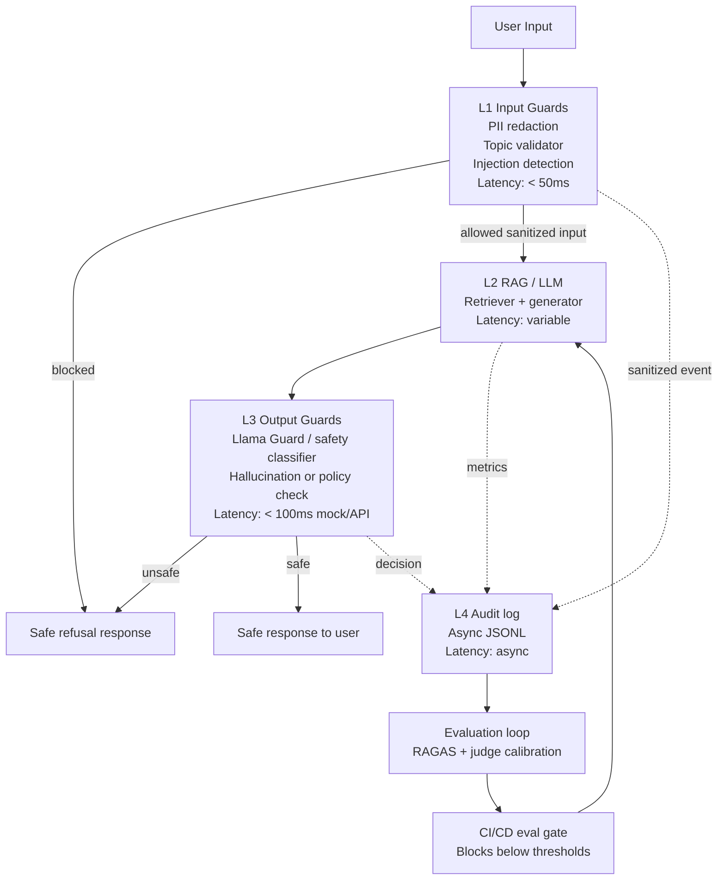

# Lab 24 Blueprint — Full Evaluation & Guardrail System

## 1. SLO Definition

| Metric | Target | Alert Threshold | Severity |
|---|---:|---:|---|
| Faithfulness | >= 0.85 | < 0.80 for 30 min | P2 |
| Answer Relevancy | >= 0.80 | < 0.75 for 30 min | P2 |
| Context Precision | >= 0.70 | < 0.65 for 10 min | P1 |
| Context Recall | >= 0.75 | < 0.65 for 1 hr | P2 |
| P95 Latency with Guardrails | < 2.5s | > 3s for 5 min | P1 |
| Guardrail Detection Rate | >= 90% | < 85% | P2 |
| False Positive Rate | <= 10% | > 15% | P2 |

These SLOs separate answer quality, retrieval quality, latency, and safety. Faithfulness and answer relevancy protect user trust. Context precision and recall protect the retrieval layer. Latency keeps the user experience viable when guardrails are enabled. Guardrail detection rate and false positive rate make sure safety controls remain effective without blocking too many valid requests.

The most important operational rule is that no single score should be interpreted alone. A high answer relevancy score can hide hallucination if faithfulness drops. High context recall can still produce poor user experience if context precision is low and the generator receives distracting evidence. Guardrail detection rate can look strong while false positives silently damage valid user workflows. For that reason, the production dashboard should show the metrics together, with links from aggregate trends to sampled traces and failing examples.

The alert thresholds are intentionally lower than the targets. Targets define normal operating quality, while alert thresholds define when humans need to investigate. This avoids noisy pages for small metric movement, but still catches sustained regressions before users experience a prolonged quality drop. The CI/CD gate uses minimum acceptable values as a release blocker, while production monitoring should use time-windowed alert thresholds.

## 2. Architecture Diagram

The system blocks unsafe inputs before retrieval or generation, redacts PII before model calls and logs, and checks final answers before returning them. The audit log stores sanitized input, layer decisions, and timings only. Evaluation artifacts feed the CI/CD gate so regressions are caught before deployment.

Layer L1 is intentionally lightweight. It should complete in under 50ms for most requests because it uses regex, keyword scope checks, and prompt-injection pattern detection. If an input is blocked at L1, the system returns a graceful refusal and does not call retrieval or generation. This reduces cost and prevents dangerous prompts from entering downstream components.

Layer L2 owns the real RAG or LLM behavior. In this starter implementation, L2 is a deterministic mock RAG pipeline, but the interface is designed so the Day 18 RAG system can replace it without changing the guardrail contract. The production version should preserve the same return shape: question, answer, contexts, and ground truth when available. This keeps evaluation, logging, and guardrails stable while the retrieval implementation evolves.

Layer L3 checks the final answer. This matters because even safe user inputs can produce unsafe model outputs if retrieval contains adversarial document text, stale private content, or high-stakes advice. A hosted Llama Guard style classifier is appropriate at low or medium traffic. At higher traffic, the team can evaluate whether a smaller local classifier or GPU-hosted guardrail model is cheaper.

Layer L4 is asynchronous audit logging. Logs should include sanitized input, blocked status, safety decision, timings, metric sample IDs, and non-sensitive context metadata. Logs must not include raw PII, raw secrets, hidden prompts, or full private documents. Audit logging should never block the user response path.

The evaluation loop has two cadences. CI/CD evaluation runs on pull requests and pushes to main. Production sampled evaluation runs on a small percentage of real traffic after PII removal and policy filtering. CI/CD catches code and prompt regressions before release, while production sampling catches data drift, new user behavior, and retrieval corpus changes.

## 3. Alert Playbook

### Incident 1: Faithfulness score drops below threshold

Severity: P2 if faithfulness stays below 0.80 for 30 minutes.

Detection: CI/CD gate failure, scheduled RAGAS evaluation, or production sampled evaluation shows faithfulness below threshold.

Likely causes: retrieval returning stale chunks, prompt changes encouraging unsupported claims, new document ingestion with conflicting information, or generator model update.

Investigation steps:
- Compare failing questions against the previous passing `ragas_results.csv`.
- Inspect retrieved contexts for each bottom question.
- Check recent changes to chunking, embeddings, prompt templates, and model version.
- Run a small manual trace with known ground-truth questions.

Resolution:
- Roll back risky prompt or model changes if regression is broad.
- Add metadata filters or reranking if contexts are weak.
- Increase top_k from 3 to 5 for low-recall clusters.
- Add missing source documents or fix chunk boundaries.

SLO impact: user trust is degraded because answers may not be grounded. Keep the release blocked until the minimum faithfulness threshold is restored.

Post-incident follow-up should add the failed examples to the regression set. If the root cause was corpus drift, update ingestion validation. If the root cause was prompt drift, require prompt diff review before deployment. If the root cause was retriever behavior, add retrieval-level tests that inspect retrieved chunk IDs, not only final answers.

### Incident 2: Latency P95 exceeds threshold

Severity: P1 when P95 latency with guardrails is above 3 seconds for 5 minutes.

Detection: latency benchmark, APM traces, or production percentile dashboards show P95 over the alert threshold.

Likely causes: slow retrieval backend, cold model calls, synchronous audit logging, output guard API latency, or excessive context size.

Investigation steps:
- Break down timings by L1, L2, L3, and total.
- Check whether output guard API latency changed.
- Inspect retrieval query latency and vector database health.
- Verify audit logging is async and not blocking response flow.

Resolution:
- Cache retrieval results for repeated queries.
- Use a smaller guard model or local fallback during incidents.
- Reduce context size or apply reranking before generation.
- Move logging and evaluation sampling to async workers.

SLO impact: high latency harms usability even if answer quality is acceptable. Prioritize changes that reduce P95 and P99 without disabling required safety checks.

Post-incident follow-up should include a latency budget review. Each layer should have an owner and an expected budget. If the output guard is the bottleneck, the team should test model choice, timeout behavior, and fail-open versus fail-closed policy for low-risk requests. For high-risk requests, safety should fail closed even during provider incidents.

### Incident 3: Guardrail detection rate drops

Severity: P2 when adversarial detection falls below 85%.

Detection: scheduled adversarial tests, red-team suite, or sampled production review shows missed attacks.

Likely causes: new jailbreak phrasing, weak regex coverage, policy changes not reflected in prompts, or output guard provider changes.

Investigation steps:
- Identify missed categories: DAN, roleplay, payload splitting, encoding, or indirect injection.
- Compare latest attack corpus with the previous version.
- Review false negatives and false positives separately.
- Check whether PII redaction still runs before logging.

Resolution:
- Add patterns for missed attack families.
- Update the Llama Guard or safety prompt rubric.
- Add human-reviewed adversarial examples to the regression suite.
- Use defense in depth: input block, retrieval sanitization, and output check.

SLO impact: unsafe requests may reach the RAG layer or final user response. Treat repeated misses as a safety regression and block release until the suite passes.

Post-incident follow-up should update the adversarial corpus and label missed examples by attack family. The team should track detection rate by category, not only the aggregate number. A model can perform well on DAN prompts while missing indirect injection through document content, and the aggregate score may hide that weakness.

### Incident 4: False positive rate exceeds threshold

Severity: P2 when valid requests are blocked above 15%.

Detection: production review samples, user support tickets, or offline validation show valid Lab 24 questions being rejected by the topic validator or injection detector.

Likely causes: overly broad regex patterns, keyword scope too narrow, new legitimate terminology, or safety classifier prompt drift.

Investigation steps:
- Review blocked requests labeled as safe by human reviewers.
- Separate topic false positives from injection false positives.
- Check whether PII redaction changed the text enough to break topic matching.
- Compare false positive rate before and after the last rules update.

Resolution:
- Narrow broad injection patterns with context words.
- Add allowed-topic synonyms and evaluation terms.
- Add a low-risk clarification path instead of immediate refusal for ambiguous scope.
- Add false positive examples to regression tests.

SLO impact: false positives reduce trust and make the assistant feel unreliable. The fix should preserve attack detection while restoring valid user workflows.

## 4. Cost Analysis

Estimate for 100k queries/month:

| Component | Unit Cost | Volume | Monthly Cost |
|---|---:|---:|---:|
| RAG generation | estimated $0.002/query | 100k | $200 |
| RAGAS continuous eval | estimated $0.025/sample | 1k sample | $25 |
| LLM Judge | estimated $0.01/pair | 5k pairs | $50 |
| Llama Guard API/GPU | estimated $0.0005/query | 100k | $50 |
| Storage/logging | estimated $0.00005/event | 100k | $5 |
| Total |  |  | $330 |

Cost optimization opportunities:
- Sample instead of evaluating every query.
- Use a smaller judge model for routine comparisons.
- Cache retrieval results for repeated or semantically similar questions.
- Only run expensive evaluation on sampled traffic or changed corpora.
- Use async audit logging so safety metadata does not slow the user path.
- Use API-based guardrails for low volume and self-host only when volume justifies GPU cost.

The cost model should be reviewed monthly because model pricing and traffic shape can change quickly. The biggest cost lever is sampling rate. Evaluating every query with RAGAS and LLM-as-judge is usually unnecessary. A practical default is to run full evaluation on a stable sample, then increase sampling temporarily after major prompt, model, retriever, or corpus changes.

Caching should be applied carefully. Retrieval caches are usually safe when keyed by normalized query, corpus version, embedding model, and metadata filters. Generation caches need stricter invalidation because answers can depend on policy version and system prompt version. Guardrail decisions can be cached for exact repeated text, but PII-containing text should never be stored raw as a cache key.

## 5. Governance and Ownership

Production evaluation needs named owners. The retrieval owner is responsible for context precision, context recall, chunking, embeddings, and reranking. The generation owner is responsible for answer prompt quality, faithfulness, answer relevancy, and refusal behavior. The safety owner is responsible for PII redaction, prompt-injection detection, output guard policy, and adversarial test coverage. The platform owner is responsible for CI/CD gates, audit logs, latency monitoring, and cost dashboards.

Every release should include an evaluation note. The note should record the test set version, RAGAS summary, judge calibration summary, guardrail detection rate, latency percentiles, and any known exceptions. If a release changes prompts, retrieval settings, model versions, or guardrail rules, it should run the full evaluation suite before merge.

Human review remains part of the system. Automated judges are useful for scale, but they can inherit model bias, length preference, position preference, and rubric ambiguity. A small recurring human-label set should be maintained for calibration. Cohen's Kappa should be tracked over time; a sudden drop means the judge prompt, model, or task distribution may have shifted.

## 6. Data Retention and Privacy

The audit log should retain only sanitized input and operational metadata. Raw PII should be redacted before logging and before optional model calls when possible. Sensitive values such as emails, phone numbers, CCCD IDs, bank accounts, API keys, passwords, and private names should be replaced with typed placeholders. Logs should include enough information to debug policy and latency decisions without reconstructing the user's private text.

Retention should match the risk profile. For a classroom lab, local JSONL or CSV logs are acceptable. In production, logs should be access-controlled, encrypted at rest, and expired according to policy. High-risk events can be retained longer as aggregated metadata, but raw or reconstructable private content should not be kept unless there is a clear legal and operational requirement.

## 7. Release Gate Policy

The CI/CD gate blocks releases when any minimum metric fails: faithfulness below 0.75, answer relevancy below 0.70, context precision below 0.60, or context recall below 0.65. These are minimum acceptable values, not success targets. Passing the gate means the build is safe enough to review; it does not mean the system is production-perfect.

When the gate fails, the release owner should inspect the failure analysis, identify whether the issue is retrieval, generation, or evaluation data, and either fix the regression or explicitly document why the test is invalid. The preferred fix is to improve the system, not to lower thresholds. Threshold changes should require reviewer approval and an explanation in the release note.

## Operating Notes

The starter implementation is intentionally deterministic when API keys are missing. In production, deterministic fallbacks should remain available for CI and local development, while online jobs use real model calls for RAGAS, LLM judging, and output safety. All production logs must store sanitized input only, plus metadata, timings, and guardrail decisions.

This blueprint should be updated whenever the RAG pipeline changes materially. Examples include switching embedding models, changing chunk sizes, adding new document sources, replacing the generator model, changing safety policy, or modifying the judge rubric. The blueprint is not only a report for the lab; it is the operating contract for keeping the system measurable, debuggable, and safe.
